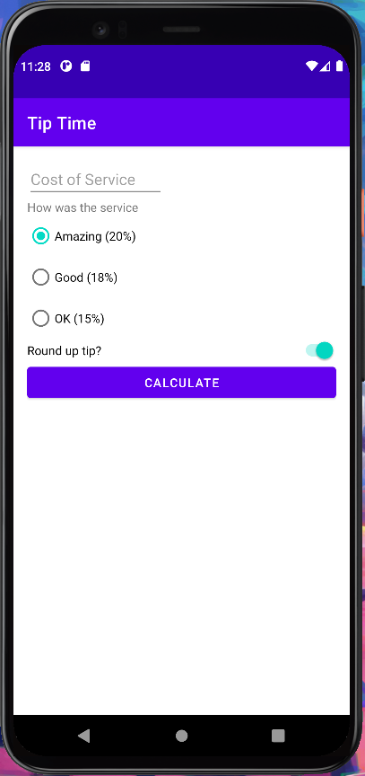

# A1: Hello Android (Jeremy Cao)

## Overview

I built a tip calculator! Yea!

## Using the app 

Tell me anything I need to know about running the app. User can enter an amount of cost of service, then user is prompted to select a tip percentage
from a list of 20%, 18%, 15%. Then once the user click CALCULATE button, the tips amount will be calculated and displayed. User can also turn on the 
option of Round up the tip.

## Walkthrough

Include some screenshots and information. Put the screenshots in the [imgs](imgs) directory, and include them in this readme like this: 

Or use html to resize it: 

## Reflection/Summary

Summary of why you chose this project, what you learned or found surprising, what you found challenging or unexpected. You might include something you didn't finish or polish or would like to do different in the future. 

